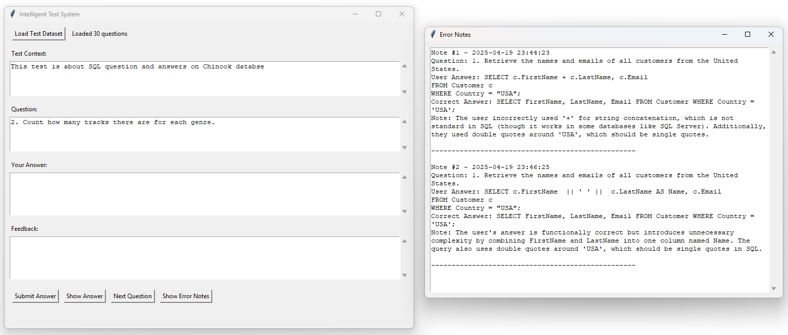

# Intelligent Test System

A modern, AI-powered test-taking application that provides intelligent feedback and evaluation for user responses.



## Overview

The Intelligent Test System is a desktop application built with Python and Tkinter that allows users to take tests with intelligent evaluation of their answers. The system is built with LangChain and it uses a local LLM (Qwen 2.5 32B by default) to evaluate responses and provide helpful feedback, making it an excellent tool for self-assessment and learning.

## Features

- **Intelligent Answer Evaluation**: Uses AI to evaluate answers based on meaning and concepts, not just exact wording
- **Helpful Feedback**: Provides hints when answers are incorrect to guide users toward the correct answer
- **Error Tracking**: Maintains a log of incorrect answers with detailed notes for review
- **User-Friendly Interface**: Clean, intuitive design with clear sections for context, questions, and answers
- **Dataset Management**: Load test datasets from CSV files with associated context descriptions

## Requirements

- Python 3.8+
- Tkinter (usually comes with Python)
- LangChain
- Pydantic
- Ollama (for running the Qwen 2.5 32B model locally)

## Installation

1. Clone this repository.

2. Install the required dependencies:
   ```
   pip install langchain-openai pydantic
   ```

3. Install and set up Ollama with the Qwen 2.5 32B model:
   ```
   # Follow instructions at https://ollama.ai to install Ollama
   ollama pull qwen2.5:32b-instruct-q4_K_S
   ```

## Usage

1. Run the application:
   ```
   python main.py
   ```

2. Click "Load Test Dataset" to select a folder containing:
   - A text file (.txt) with the test context/description
   - A CSV file with columns for "Question" and "Answer"

3. Navigate through questions using the "Next Question" button

4. Enter your answer in the text area and click "Submit Answer"

5. Review the AI-generated feedback

6. Use "Show Answer" to see the correct answer if needed

7. Access your error notes by clicking "Show Error Notes"

## Dataset Format

### Context File (.txt)
A plain text file containing the context or description for the test.

### Questions File (.csv)
A CSV file with at least two columns:
- `Question`: The question text
- `Answer`: The correct answer

## Error Notes

The system automatically saves notes about incorrect answers to a JSON file in the dataset folder. These notes include:
- Timestamp
- Question
- User's answer
- Correct answer
- Educational note about the mistake


## Acknowledgements

- Built with [LangChain](https://github.com/langchain-ai/langchain)
- Uses [Qwen 2.5 32B](https://github.com/Qwen/Qwen) model via Ollama 