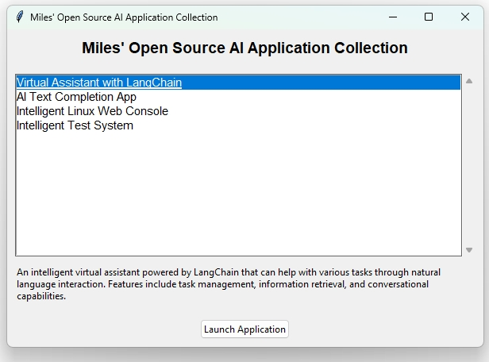
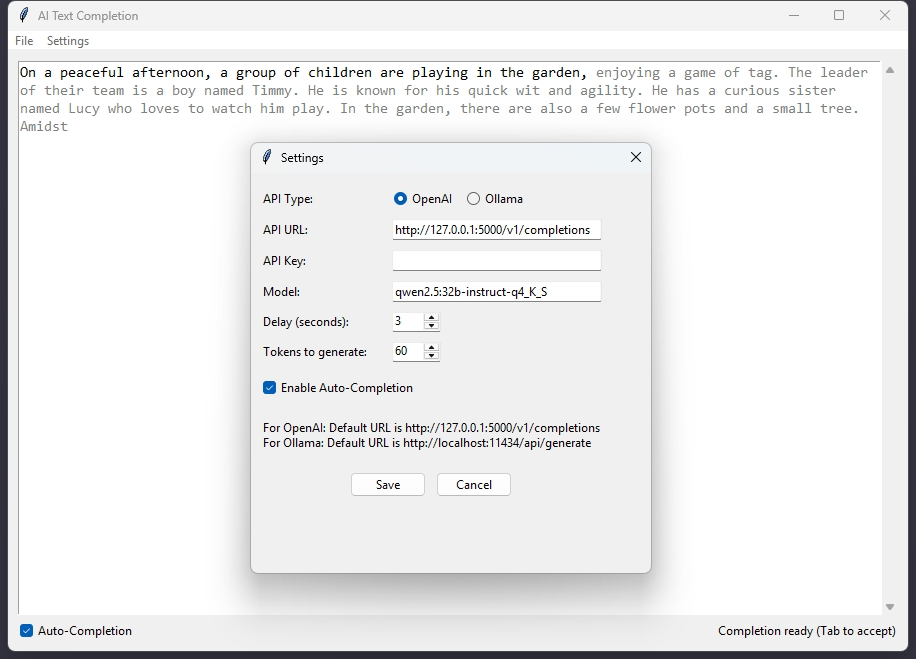
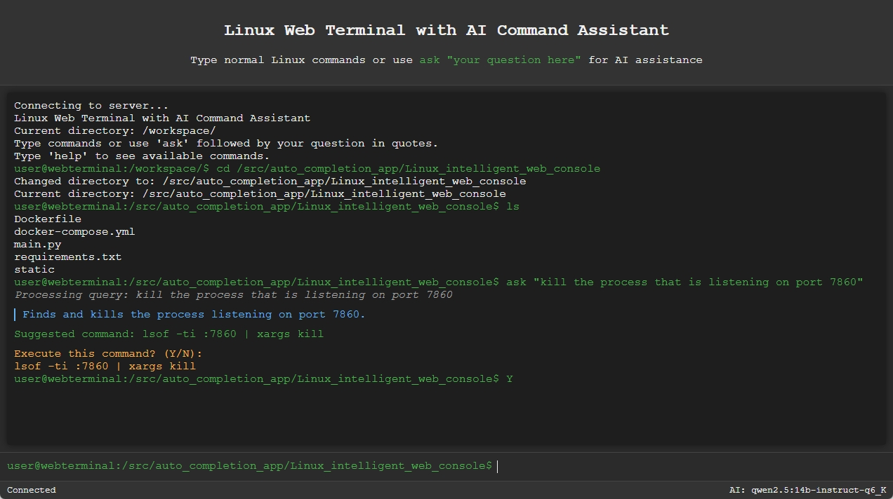
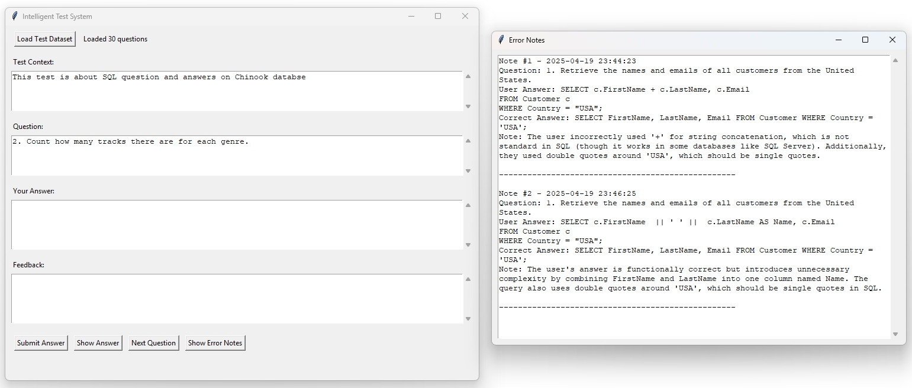

# Miles' Open Source AI Application Collection

A curated collection of open-source applications powered by foundation models, designed to demonstrate practical applications of AI in everyday tools.

## Quick Start

You can launch any application in the collection using our convenient launcher:

- **Windows**: Double click `launcher.bat`
- **Linux/Mac**: Run `./launcher.sh`



The launcher provides an easy-to-use interface to browse and start any application in the collection.

## Applications

### 1. Virtual Customer Service Representative (VirtualCustomerServiceRepresentative/)

Two-page web app (Admin and Chat) with a FastAPI backend using LangChain + LangGraph ReAct agent and FAISS vector store (Ollama embeddings) for retrieval augmented generation. See project README for setup and details. Source: [VirtualCustomerServiceRepresentative](https://github.com/MilesQLi/VirtualCustomerServiceRepresentative)

Quick start:
```bash
python -m venv .venv
. .venv/Scripts/activate  # Windows PowerShell: .venv\Scripts\Activate.ps1
pip install -r requirements.txt
uvicorn app.main:app --reload --host 0.0.0.0 --port 8000
```

Open:
- Admin: http://localhost:8000/admin
- Chat: http://localhost:8000/


### 2. Virtual Assistant (VirtualAssistanceLangChain/)

A powerful virtual assistant system with tool usage functions that support RAG, such as calendar management, note-taking capabilities for persistent memory, python code execution, and web search functionality. Built with Python, LangChain, and Tkinter, it provides a user-friendly interface for interacting with an AI assistant. The system features calendar management with event scheduling and reminders, note-taking with vector storage, web search capabilities, and persistent storage for both calendar events and knowledge base.


### 3. AI Text Completion App (auto_completion_app/)

A desktop application that provides real-time AI-powered text completion suggestions as you type, supporting both OpenAI and Ollama language models. The app features a clean, intuitive interface with customizable settings for different AI models and completion behaviors. Perfect for writers, developers, or anyone looking to enhance their typing efficiency with AI assistance.



### 4. Intelligent Linux Web Console (Linux_intelligent_web_console/)

A web-based Linux terminal console powered by LangChain and LLMs that helps users execute commands through natural language understanding. The console combines traditional terminal functionality with AI assistance to make command-line operations more accessible.



### 5. Intelligent Test System (Intelligent_Test_System/)

A modern, AI-powered test-taking application that provides intelligent feedback and evaluation for user responses. Built with Python and Tkinter, it uses a local LLM (Qwen 2.5 32B by default) to evaluate answers based on meaning and concepts, not just exact wording. The system provides helpful hints for incorrect answers and maintains a log of errors for review, making it an excellent tool for self-assessment and learning.



### 6. Lightning Fabric Distributed Pretraining (LightningFabricDistributedPretraining/)

A flexible framework for distributed pretraining of language models using Lightning Fabric with FSDP (Fully Sharded Data Parallel) strategy. This application allows you to pretrain any Hugging Face model on any dataset with a simple YAML configuration. It supports multi-GPU and multi-node training with optimized performance for modern NVIDIA GPUs with Tensor Cores.

### 7. HuggingFace Pretraining Script (HuggingFace_Pretraining/)

A comprehensive and configurable script for pretraining language models using the HuggingFace Transformers library. This script provides a streamlined way to pretrain models on custom datasets with features including:

- Configurable model architecture and training parameters via YAML
- Mixed precision training (FP16) for improved efficiency
- TensorBoard logging support
- Automatic handling of tokenization and data collation
- Support for any dataset from HuggingFace Hub
- Distributed training support via Accelerate

Example usage:
```bash
accelerate launch pretrain.py --config default_pretrain_config.yaml
```

### 8. HuggingFace SFT Training Script (HuggingFace_SFT/)

A powerful script for conducting distributed fine-tuning of language models using Supervised Fine-Tuning (SFT) with configurable parameters loaded from a YAML file.  It properly sets up the training mechanics so as no to train on input part. It is a perfect template for researchers and developers looking to fine-tune language models on their specific datasets with minimal setup.

## Coming Soon

More AI-powered applications are in development and will be added to this collection. Stay tuned for applications in areas such as:
- Image Generation
- Code Assistance
- Document Analysis
- Audio Processing
- And more!

## Requirements

- Python 3.x
- tkinter (usually comes with Python)
- Additional requirements specific to each application

## Manual Launch

If you prefer to run applications directly:

1. Navigate to the application directory
2. Run the application using Python:
   ```bash
   python main.py
   ```

## Contributing

Contributions are welcome! If you have ideas for new AI applications or improvements to existing ones, please feel free to submit a Pull Request.

## Disclaimer

All projects in this software are provided "as is", without warranty of any kind, express or implied, including but not limited to the warranties of merchantability, fitness for a particular purpose and noninfringement. In no event shall the authors or copyright holders be liable for any claim, damages or other liability, whether in an action of contract, tort or otherwise, arising from, out of or in connection with the software or the use or other dealings in the software.

Users are responsible for checking and validating the correctness of their configuration files, safetensor files, and binary files generated using the software. The developers assume no responsibility for any errors, omissions, or other issues coming in these files, or any consequences resulting from the use of these files.

## License

Apache 2.0