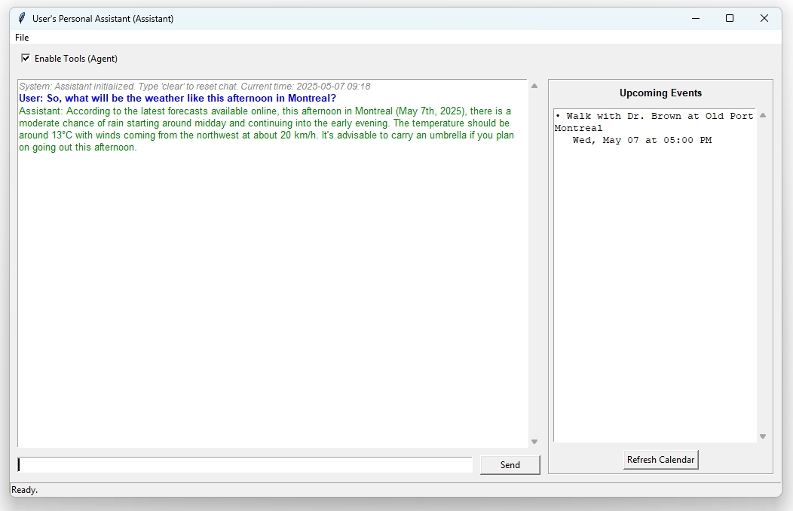

# Virtual Assistant with LangChain

A powerful virtual assistant system with tool usage functions that support RAG, such as calendar management, note-taking capabilities for persistent memory, python code execution, and web search functionality. It is built with Python, LangChain, and Tkinter that provides a user-friendly interface for interacting with an AI assistant. 


## Features

- 🤖 AI-powered conversation using local LLM models (via Ollama)
- 📅 Calendar management with event scheduling and reminders
- 📝 Note-taking and knowledge base using vector storage
- 🔍 Web search capabilities
- 💾 Persistent storage for calendar events and knowledge base
- 🎯 Tool-enabled agent mode for enhanced capabilities
- 🎨 Modern Tkinter-based GUI interface

## Prerequisites

- Python 3.8+
- Ollama installed and running locally
- Required Python packages (see Installation section)


## Configuration

The system can be configured by modifying the following variables in `main.py`:

- `USER_NAME`: Your preferred name
- `HOST_NAME`: Assistant's name
- `LOCAL_MODEL_NAME`: Your preferred Ollama model
- `EMBEDDING_MODEL_NAME`: Your preferred embedding model
- `CALENDAR_REMINDER_MINUTES`: Time before event to show reminder
- `CALENDAR_CHECK_INTERVAL_SECONDS`: How often to check for upcoming events

## Usage

1. Start the application:
```bash
python main.py
```

2. The main interface provides:
   - Chat window for conversation
   - Calendar view showing upcoming events
   - Tools toggle for enabling/disabling agent capabilities

3. Key features:
   - Type messages in the input field and press Enter or click Send
   - Use the calendar view to see upcoming events
   - Enable/disable tools using the checkbox
   - Save chat history using File menu
   - Clear chat history using File menu

## Calendar Management

The assistant can help you:
- Add events to your calendar
- View upcoming events
- Receive reminders for upcoming events
- Manage event scheduling

## Knowledge Base

The system maintains a persistent knowledge base that:
- Stores important information and notes
- Uses vector embeddings for semantic search
- Allows retrieval of relevant information based on queries

## Development

The system is built using:
- LangChain for AI/LLM integration
- FAISS for vector storage
- SQLite for calendar persistence
- Tkinter for the GUI
- Threading for background tasks

## Contributing

Contributions are welcome! Please feel free to submit a Pull Request.

## Disclaimer

This project is provided "as is", without warranty of any kind, express or implied, including but not limited to the warranties of merchantability, fitness for a particular purpose and noninfringement. In no event shall the authors or copyright holders be liable for any claim, damages or other liability, whether in an action of contract, tort or otherwise, arising from, out of or in connection with the software or the use or other dealings in the software.

Users are responsible for checking and validating the correctness of their configuration files, safetensor files, and binary files generated using the software. The developers assume no responsibility for any errors, omissions, or other issues coming in these files, or any consequences resulting from the use of these files.